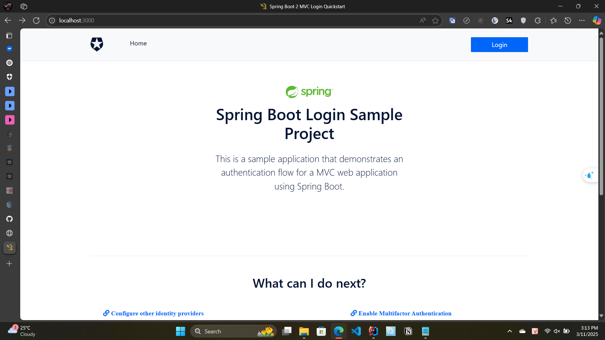
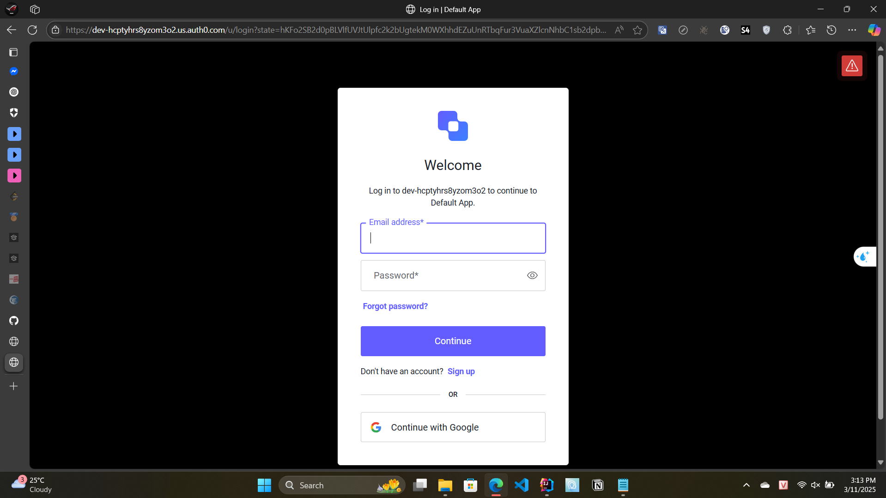
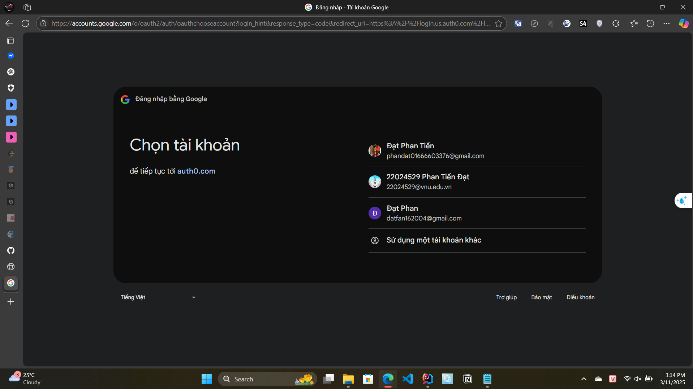
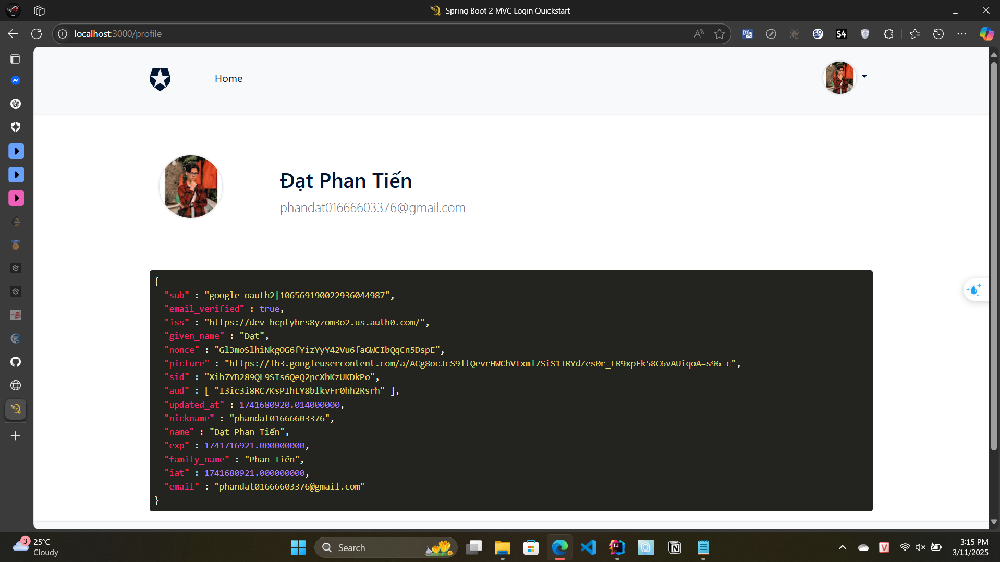

# Spring Boot Login - MVC

This sample demonstrates:

- Adding authentication with Auth0 using the [Okta Spring Boot Starter](https://github.com/okta/okta-spring-boot) to a Spring Boot MVC application
- Accessing profile information of the authenticated user
- Only allowing authenticated users to access certain resources

## Requirements

- Java 17

## Configuration

### Auth0 Dashboard
1. On the [Auth0 Dashboard](https://manage.auth0.com/#/clients) create a new Application of type **Regular Web Application**.
1. On the **Settings** tab of your application, add the URL `http://localhost:3000/login/oauth2/code/auth0` to the **Allowed Callback URLs** field.
1. On the **Settings** tab of your application, add the URL `http://localhost:3000/` to the **Allowed Logout URLs** field.
1. Save the changes to your application settings. Don't close this page; you'll need some of the settings when configuring the application below.

### Application configuration

Copy `src/main/resources/application.yml.example` to `src/main/resources/application.yml`:

```bash
cp src/main/resources/application.yml.example src/main/resources/application.yml
```

Set the application values in the `src/main/resources/application.yml` file to the values of your Auth0 application.

```yaml
client-id: {YOUR-CLIENT-ID}
client-secret: {YOUR-CLIENT-SECRET}
issuer-uri: https://{YOUR-DOMAIN}/
```

### Running the sample

Open a terminal, go to the project root directory and run the following command:

Linux or MacOS:

```bash
./gradlew bootRun
```

Windows:

```bash
gradlew.bat bootRun 
```

The application will be accessible at http://localhost:3000.

### Running the sample with docker

In order to run the example with [Docker](https://docs.docker.com/install/) you need to have `docker` installed.

You also need to set the client values as explained [previously](#application-configuration).

Execute the command to run Docker for your environment:

Linux or MacOS:

```bash
sh exec.sh
```

Windows:

```bash
.\exec.ps1
```

The application will be accessible at http://localhost:3000.

## Demo

1. Go to http://localhost:3000.
  
2. Click on the **Login** button.
3. You will be redirected to the Auth0 login page.

4. Login with Google.

5. You will be redirected back to the application.


## License

This project is licensed under the MIT license. See the [LICENSE](../LICENSE) file for more info.